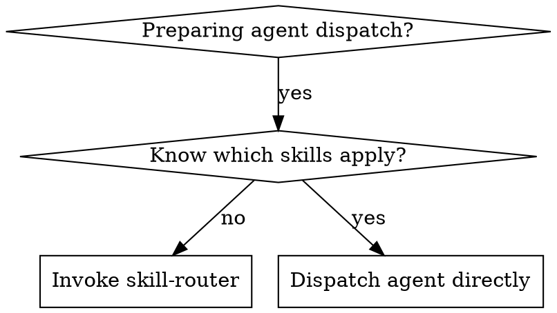
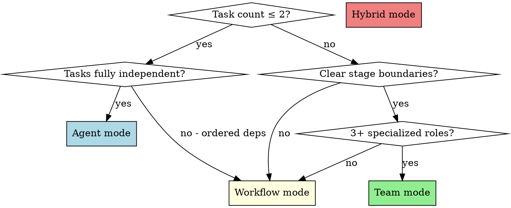
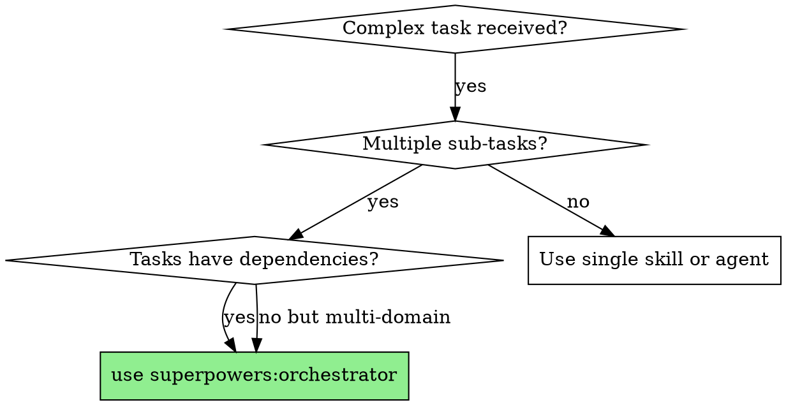
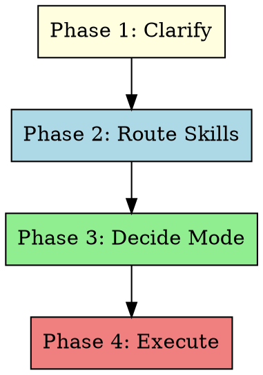

# Orchestrator + Skill Router Implementation Plan

> **For agentic workers:** REQUIRED SUB-SKILL: Use superpowers:subagent-driven-development (recommended) or superpowers:executing-plans to implement this plan task-by-task. Steps use checkbox (`- [ ]`) syntax for tracking.

**Goal:** Add intelligent task orchestration and automatic skill routing to the superpowers plugin, enabling multi-step coordination with Agent/Workflow/Team execution modes.

**Architecture:** Two new skills — `orchestrator` (4-phase flow: clarify → route → decide → execute) and `skill-router` (semantic scanning of registered skill frontmatter) — plus updates to `using-superpowers` to register them. Skills are prompt-driven markdown documents, not executable code. Workflow templates are reference patterns embedded in the orchestrator skill, not standalone scripts.

**Tech Stack:** Markdown skill documents (SKILL.md), Claude Code Agent/Team/Workflow tools, YAML frontmatter

---

## File Structure

```
skills/
  orchestrator/
    SKILL.md              # 主编排 skill（四阶段流程 + 路由决策 + 执行模式）
    routing-logic.md      # 智能路由决策逻辑参考文档
    workflow-patterns.md  # Workflow/Team 编排模式参考（替代 templates/ 目录）
  skill-router/
    SKILL.md              # 语义扫描 skill（收集、匹配、注入）
  using-superpowers/
    SKILL.md              # 更新：新增 orchestrator 和 skill-router
```

**设计决策：** 不使用 `templates/` 目录放 `.js` 文件。Workflow 脚本需要根据具体任务动态构建，预定义模板价值有限。改为 `workflow-patterns.md` 参考文档，包含模式示例供 orchestrator 动态构建时参考。

---

### Task 1: Create skill-router SKILL.md

**Files:**
- Create: `skills/skill-router/SKILL.md`

- [ ] **Step 1: Create the skill-router directory**

```bash
mkdir -p skills/skill-router
```

- [ ] **Step 2: Write skill-router SKILL.md**

Write the following content to `skills/skill-router/SKILL.md`:

```markdown
---
name: skill-router
description: Use when orchestrator or another skill needs to identify which local skills match a given task. Scans all registered skill frontmatter by name and description fields, performs semantic keyword matching against task descriptions, and returns a prioritized list of matching skills with injection instructions for agent prompts.
---

# Skill Router

## Overview

Semantic scanner that discovers which installed skills are relevant to a given task. Reads skill frontmatter, matches task keywords against skill descriptions, and generates injection instructions for agent prompts.

**Core principle:** Zero-config skill discovery — any newly installed skill is automatically discoverable without registration.

## When to Use



**Use when:**
- Preparing to dispatch an agent for a task and unsure which skills are relevant
- Orchestrator needs to map sub-tasks to specialized skills
- Want to ensure domain-specific skills (UI, debugging, testing) are loaded for appropriate tasks

**Don't use when:**
- You already know exactly which skill applies
- The task is trivial and no skill is needed

## The Scanning Process

### Step 1: Collect Skill Registry

Read the frontmatter of all registered skills. Sources to scan:

1. **Plugin skills:** All files matching `skills/*/SKILL.md` in installed plugins
2. **User skills:** All files matching `~/.claude/skills/*/SKILL.md`

For each skill, extract:
- `name` — the skill identifier (e.g., `ui-ux-pro-max`)
- `description` — the full description text (rich in keywords and triggers)

Output: A list of `{name, description}` pairs.

**How to collect:** Use the Glob tool to find all `SKILL.md` files, then Read each file's YAML frontmatter (the content between the `---` markers at the top).

### Step 2: Extract Task Keywords

From the task description, identify three categories of keywords:

- **Domain keywords:** UI, backend, debugging, testing, design, game engine, database, etc.
- **Action keywords:** create, fix, refactor, compile, deploy, review, style, layout, etc.
- **Technology keywords:** React, Lua, Godot, Cocos, Python, TypeScript, Prefab, etc.

**Extraction method:** Read the task description and list all nouns, verbs, and technology names that could relate to a specific domain or tool.

### Step 3: Semantic Matching

Compare task keywords against each skill's `description` field. Score each match:

- **High match:** Multiple keywords overlap, description explicitly mentions the domain
- **Medium match:** Some keyword overlap, tangentially related
- **Low match:** Minimal overlap, unlikely to be relevant

**Return only High and Medium matches.** Discard Low matches.

### Step 4: Generate Injection Instructions

For each matched skill, generate an injection block:

```
BEFORE starting this task, you MUST invoke the Skill tool with skill="{matched-skill-name}" to load domain-specific guidance. Follow the loaded skill's instructions during implementation.
```

The orchestrator appends these injection blocks to each agent's prompt before dispatch.

## Output Format

Return results as a structured list:

```
Task: [task description]
Matched Skills (priority order):
  1. {skill-name} — {match reason}
     Injection: "Invoke Skill tool with skill='{skill-name}' before starting"
  2. {skill-name} — {match reason}
     Injection: "Invoke Skill tool with skill='{skill-name}' before starting"
Unmatched: [brief note if no skills matched]
```

## Common Mistakes

| Mistake | Fix |
|---------|-----|
| Only checking skill names | Descriptions contain richer trigger info — always read them |
| Matching too broadly | Filter to High/Medium only. Low matches waste context |
| Forgetting user skills | Scan `~/.claude/skills/` in addition to plugin skills |
| Hardcoding skill mappings | The whole point is dynamic discovery. Never hardcode |

## Real-World Matching Examples

**Task: "Design a settings page with toggle switches and dropdown menus"**
→ Matches: `ui-ux-pro-max:ui-ux-pro-max`, `ui-ux-pro-max:ui-styling`
→ Reason: "design", "page", "toggle", "dropdown" all relate to UI/UX

**Task: "Fix the camera jitter when following the player"**
→ Matches: `closeup-camera-system`
→ Reason: "camera", "following" match camera system domain

**Task: "Debug why the Lua binding isn't updating the prefab"**
→ Matches: `jx3-prefab-mcp-luaui`, `superpowers:systematic-debugging`
→ Reason: "Lua binding", "prefab" match Cocos/Lua domain; "debug" matches debugging skill

**Task: "Add a login endpoint to the API"**
→ Matches: none (generic backend task, no specialized skill needed)
→ Note: No injection needed, proceed with standard implementation
```

- [ ] **Step 3: Verify file structure**

```bash
cat skills/skill-router/SKILL.md | head -5
```

Expected: Shows the YAML frontmatter starting with `---`

- [ ] **Step 4: Commit**

```bash
git add skills/skill-router/SKILL.md
git commit -m "feat: add skill-router skill for semantic skill discovery"
```

---

### Task 2: Create orchestrator routing-logic.md

**Files:**
- Create: `skills/orchestrator/routing-logic.md`

- [ ] **Step 1: Create the orchestrator directory**

```bash
mkdir -p skills/orchestrator
```

- [ ] **Step 2: Write routing-logic.md**

Write the following content to `skills/orchestrator/routing-logic.md`:

```markdown
# Routing Logic Reference

Decision tree for selecting execution mode. Read this after completing the clarification phase (Phase 1).

## Decision Tree



## Mode Selection Criteria

### Agent Mode

**When:** 1-2 independent tasks, no dependencies between them, no specialized roles needed.

**How:**
1. Invoke `superpowers:skill-router` to identify matching skills
2. Build agent prompt with skill injection instructions
3. Dispatch single Agent with the enriched prompt
4. Review result when agent returns

**Example scenario:** "Fix a CSS bug in the header and update the button color"

### Workflow Mode

**When:** 3+ tasks with clear stage boundaries, data flows between stages, or mix of parallel + sequential work.

**How:**
1. Invoke `superpowers:skill-router` for each stage
2. Define phases matching the stages
3. Use `pipeline()` for sequential stages with context flow
4. Use `parallel()` within a stage for independent sub-tasks
5. Each `agent()` call gets skill injection in its prompt

**Key mechanism:** `pipeline()` passes `(prevResult, originalItem, index)` to each stage — upstream output naturally flows downstream.

**Example scenario:** "Design a dashboard UI → Implement components → Write integration tests"

### Team Mode

**When:** 3+ specialized roles that need real-time coordination, complex dependency graph, or tasks need ongoing communication.

**How:**
1. Invoke `superpowers:skill-router` for each role's tasks
2. `TeamCreate` with descriptive name
3. `TaskCreate` for each task, use `addBlockedBy` for dependencies
4. Spawn teammates via `Agent` tool with `team_name` and `name`
5. Assign tasks via `TaskUpdate` with `owner`
6. Teammates communicate via `SendMessage` for context passing
7. Monitor via `TaskList`

**Key mechanism:** `TaskCreate(addBlockedBy)` enforces execution order. `SendMessage` passes context between roles.

**Example scenario:** "Designer creates mockups → Frontend implements → Backend builds API → QA tests integration"

### Hybrid Mode

**When:** Outer orchestration is a pipeline (Workflow), but specific stages need multi-role collaboration (Team).

**How:**
1. Use Workflow for the top-level pipeline
2. For stages needing collaboration, dispatch an agent that internally creates a Team
3. The Team agent acts as mini-lead for that stage

**Example scenario:** "Design system (Team: designer + architect) → Implement (Workflow: parallel components) → Review (Agent: single reviewer)"

## Dependency Graph Construction

For any mode with dependencies:

1. **List all sub-tasks** identified during Phase 1
2. **Identify dependencies** — which tasks need output from other tasks?
3. **Build a DAG:**
   - Tasks with no dependencies → Level 0 (can start immediately)
   - Tasks depending on Level 0 → Level 1
   - Tasks depending on Level 1 → Level 2
   - etc.
4. **Same-level tasks** can run in parallel
5. **Cross-level tasks** must be sequential

This DAG directly maps to:
- Workflow: `parallel()` for same-level, `pipeline()` stages for levels
- Team: `TaskCreate(addBlockedBy)` based on DAG edges
```

- [ ] **Step 3: Commit**

```bash
git add skills/orchestrator/routing-logic.md
git commit -m "feat: add orchestrator routing-logic reference"
```

---

### Task 3: Create orchestrator workflow-patterns.md

**Files:**
- Create: `skills/orchestrator/workflow-patterns.md`

- [ ] **Step 1: Write workflow-patterns.md**

Write the following content to `skills/orchestrator/workflow-patterns.md`:

```markdown
# Workflow & Team Patterns Reference

Patterns for building Workflow scripts and Team configurations. Use these as templates when constructing the execution phase.

## Pattern 1: Simple Pipeline

For tasks that flow through sequential stages with context passing.

```javascript
export const meta = {
  name: 'pipeline-{task-name}',
  description: '{task description}',
  phases: [
    { title: 'Stage 1 Name' },
    { title: 'Stage 2 Name' },
    { title: 'Stage 3 Name' }
  ]
}

// Dynamically constructed based on DAG from routing-logic.md
const tasks = [
  { name: 'task-1', prompt: '...', skills: ['skill-a'] },
  { name: 'task-2', prompt: '...', skills: ['skill-b'], dependsOn: ['task-1'] },
  { name: 'task-3', prompt: '...', skills: ['skill-c'], dependsOn: ['task-2'] }
]

phase('Stage 1 Name')
const result1 = await agent(tasks[0].prompt + '\n\nIMPORTANT: Before starting, invoke Skill tool with skill="' + tasks[0].skills[0] + '"', {label: tasks[0].name, schema: RESULT_SCHEMA})

phase('Stage 2 Name')
const result2 = await agent('Previous stage output:\n' + JSON.stringify(result1) + '\n\n' + tasks[1].prompt + '\n\nIMPORTANT: Before starting, invoke Skill tool with skill="' + tasks[1].skills[0] + '"', {label: tasks[1].name, schema: RESULT_SCHEMA})

phase('Stage 3 Name')
const result3 = await agent('Previous stage output:\n' + JSON.stringify(result2) + '\n\n' + tasks[2].prompt + '\n\nIMPORTANT: Before starting, invoke Skill tool with skill="' + tasks[2].skills[0] + '"', {label: tasks[2].name, schema: RESULT_SCHEMA})

return { result1, result2, result3 }
```

## Pattern 2: Pipeline with Parallel Branches

For stages where some tasks can run concurrently.

```javascript
export const meta = {
  name: 'pipeline-parallel-{task-name}',
  description: '{task description}',
  phases: [
    { title: 'Design' },
    { title: 'Implement' },
    { title: 'Integrate' }
  ]
}

const designResult = { /* from Phase 1 */ }

phase('Implement')
const implResults = await parallel([
  () => agent('Implement component A based on design:\n' + JSON.stringify(designResult) + '\n\n{skill-injection}', {label: 'impl-a', phase: 'Implement', schema: RESULT_SCHEMA}),
  () => agent('Implement component B based on design:\n' + JSON.stringify(designResult) + '\n\n{skill-injection}', {label: 'impl-b', phase: 'Implement', schema: RESULT_SCHEMA})
])

phase('Integrate')
const integrated = await agent('Integrate these components:\n' + JSON.stringify(implResults) + '\n\n{task-description}', {label: 'integrate', schema: RESULT_SCHEMA})

return { designResult, implResults, integrated }
```

## Pattern 3: Full Pipeline with auto-parallel Detection

Use `pipeline()` to let each item flow through stages independently. Items progress at their own pace — no barrier between stages.

```javascript
export const meta = {
  name: 'auto-pipeline-{task-name}',
  description: '{task description}',
  phases: [
    { title: 'Analyze' },
    { title: 'Implement' },
    { title: 'Verify' }
  ]
}

const items = [/* sub-tasks from Phase 1 */]

const results = await pipeline(
  items,
  async (item) => {
    phase('Analyze')
    return await agent(`Analyze: ${item.description}\n\n{skill-injection}`, {label: `analyze:${item.name}`, phase: 'Analyze', schema: ANALYSIS_SCHEMA})
  },
  async (analysis, item) => {
    phase('Implement')
    return await agent(`Analysis:\n${JSON.stringify(analysis)}\n\nImplement: ${item.description}\n\n{skill-injection}`, {label: `impl:${item.name}`, phase: 'Implement', schema: IMPL_SCHEMA})
  },
  async (impl, item) => {
    phase('Verify')
    return await agent(`Implementation:\n${JSON.stringify(impl)}\n\nVerify: ${item.description}`, {label: `verify:${item.name}`, phase: 'Verify', schema: VERIFY_SCHEMA})
  }
)

return results
```

## Pattern 4: Team Collaboration

For multi-role tasks requiring ongoing communication.

**Construction steps (not a script — Team mode uses tool calls):**

1. **Create team:** `TeamCreate({ team_name: 'task-name-team', description: '...' })`

2. **Create tasks with dependencies:**
```
TaskCreate({ subject: 'Design UI', description: '...', addBlocks: ['Implement UI', 'QA Test'] })
TaskCreate({ subject: 'Implement UI', description: '...', addBlockedBy: ['Design UI'], addBlocks: ['QA Test'] })
TaskCreate({ subject: 'QA Test', description: '...', addBlockedBy: ['Implement UI'] })
```

3. **Spawn teammates:**
```
Agent({ name: 'designer', team_name: 'task-name-team', prompt: 'You are the UI designer. Use Skill tool to load ui-ux-pro-max:ui-ux-pro-max before designing. Claim and complete design tasks from TaskList.' })
Agent({ name: 'implementer', team_name: 'task-name-team', prompt: 'You are the frontend implementer. Claim and complete implementation tasks from TaskList.' })
Agent({ name: 'reviewer', team_name: 'task-name-team', prompt: 'You are the QA reviewer. Claim and complete review tasks from TaskList.' })
```

4. **Monitor:** Check `TaskList` periodically. When a teammate completes, it sends you a message automatically.

5. **Shutdown:** When all tasks complete, `SendMessage({ to: 'designer', message: { type: 'shutdown_request', reason: 'All tasks complete' } })` for each teammate. Then `TeamDelete()`.

## Context Passing Patterns

### Pipeline prevResult
```
Stage 1 output → Stage 2 input (automatic via pipeline callback)
```

### Team SendMessage
```
designer completes → SendMessage({ to: 'implementer', message: 'Design complete. Key decisions: ...' })
```

### Agent prompt injection
```
Agent prompt includes: "Upstream context: {JSON.stringify(previousResult)}"
```
```

- [ ] **Step 2: Commit**

```bash
git add skills/orchestrator/workflow-patterns.md
git commit -m "feat: add orchestrator workflow-patterns reference"
```

---

### Task 4: Create orchestrator SKILL.md

**Files:**
- Create: `skills/orchestrator/SKILL.md`

This is the main skill document. It references the two supporting files created in Tasks 2-3.

- [ ] **Step 1: Write orchestrator SKILL.md**

Write the following content to `skills/orchestrator/SKILL.md`:

```markdown
---
name: orchestrator
description: Use when facing a complex task requiring multi-step coordination, task dependency management, or automatic skill composition. Triggers when task involves multiple domains like UI and backend together, has clear dependency chains between sub-tasks, needs parallel execution with context flow between stages, or requires more than simple sequential agent dispatch.
---

# Orchestrator

## Overview

Intelligent task orchestrator that analyzes complex requests, maps them to specialized skills, selects the optimal execution mode (Agent / Workflow / Team), and coordinates execution with dependency management and context passing.

**Core principle:** Clarify first, route skills, then execute with the right tool for the job.

**Announce at start:** "I'm using the orchestrator skill to coordinate this task."

## When to Use



**Use when:**
- Task spans multiple domains (UI + backend, design + implementation)
- Multiple sub-tasks with dependencies between them
- Need to run tasks in parallel with context flow
- Task complexity is beyond simple sequential agent dispatch

**Don't use when:**
- Simple single-domain task → use the relevant skill directly
- Building something from scratch → use `superpowers:brainstorming` first
- Already have a written plan → use `superpowers:subagent-driven-development`

## The Four Phases



### Phase 1: Clarify Requirements

Engage in multi-turn dialogue to understand the task. Do NOT skip this phase.

**Process:**

1. **Explore context** — Check current project state (files, recent changes, relevant code)
2. **Ask one question at a time** — Understand:
   - What is the overall goal?
   - What sub-tasks are involved?
   - What are the dependencies between sub-tasks?
   - What technical domains are involved?
   - What are the constraints or non-goals?
3. **Confirm understanding** — Restate the task in your own words, ask for approval

**Questions to ask (pick relevant ones, one at a time):**

- "What's the end result you want?"
- "Can you break this down into steps? Which steps depend on others?"
- "What technologies or domains does this touch?"
- "Are there any constraints I should know about?"
- "What would make this complete for you?"

**Exception:** If the request is to design something entirely new from scratch, recommend using `superpowers:brainstorming` → `superpowers:writing-plans` instead. Orchestrator is for coordinating known tasks, not open-ended design exploration.

**Output of Phase 1:** A structured list of sub-tasks with dependencies noted.

### Phase 2: Route Skills

Invoke `superpowers:skill-router` (via Skill tool) to identify which skills should be loaded for each sub-task.

**Process:**

1. Invoke Skill tool with `skill="superpowers:skill-router"`, passing the sub-task list
2. Review the matched skills and their injection instructions
3. Note which skills apply to which sub-tasks

**If no skills match:** That's fine — some tasks don't need specialized skills. Proceed without injection.

### Phase 3: Decide Execution Mode

Read the routing logic in `@routing-logic.md` (this directory) and select the execution mode.

**Quick decision:**

| Signal | Mode |
|--------|------|
| 1-2 tasks, no dependencies | **Agent** |
| 3+ tasks with stage flow | **Workflow** |
| 3+ specialized roles, real-time comms | **Team** |
| Pipeline + multi-role stages | **Hybrid** |

### Phase 4: Execute

Execute using the selected mode. Reference `@workflow-patterns.md` for construction patterns.

#### Agent Mode

1. Build prompt with skill injection instructions from Phase 2
2. Dispatch single Agent
3. Review result

```
Agent({
  description: "Task description",
  prompt: "{task details}\n\nIMPORTANT: Before starting, invoke the Skill tool with skill=\"{matched-skill}\" to load domain-specific guidance.",
  subagent_type: "general-purpose"
})
```

#### Workflow Mode

1. Construct a Workflow script following patterns from `@workflow-patterns.md`
2. Define `meta.phases` matching the task stages
3. Use `pipeline()` for sequential context flow
4. Use `parallel()` for independent same-level tasks
5. Inject skill loading instructions into each `agent()` prompt

**Skill injection in Workflow agent calls:**

```
agent('{task prompt}\n\nIMPORTANT: Before starting, invoke the Skill tool with skill="{skill-name}" to load domain-specific guidance.', {label: 'task-label', schema: RESULT_SCHEMA})
```

#### Team Mode

1. `TeamCreate({ team_name: '...', description: '...' })`
2. `TaskCreate` for each sub-task with `addBlockedBy` for dependencies
3. Spawn teammates via `Agent` with `team_name` and descriptive `name`
4. Each teammate's prompt includes skill injection instructions
5. Monitor via `TaskList`
6. When complete, shutdown teammates and `TeamDelete()`

**Skill injection in Team agent prompts:**

```
Agent({
  name: "role-name",
  team_name: "team-name",
  prompt: "You are the {role}. Your responsibilities: ...\n\nIMPORTANT: Before starting your tasks, invoke the Skill tool with skill=\"{matched-skill}\" to load domain-specific guidance. Check TaskList for available work."
})
```

## Context Passing Between Tasks

**Pipeline mode:** Use `pipeline()` — each stage receives `(prevResult, originalItem, index)` from the previous stage. Include previous results in the next agent's prompt.

**Team mode:** When a task completes, the teammate sends a message via `SendMessage`. The downstream teammate reads context from messages and `TaskGet` descriptions.

**Agent mode:** No context passing needed — single task.

## Handling Problems During Execution

**Agent fails or returns BLOCKED:**
- Assess the blocker. If it's a context issue, re-dispatch with more information. If it's a scope issue, break the task down further.

**Workflow agent returns unexpected results:**
- The pipeline continues. Include the raw result and ask the next agent to work with what's available.

**Team task stalled:**
- Check `TaskList`. If a task is blocking others, send a message to the owner. If they're stuck, re-assign or break the task down.

**No skills matched for a task:**
- Proceed without skill injection. Not every task needs a specialized skill.

## Red Flags

| Thought | Reality |
|---------|---------|
| "I can just dispatch agents sequentially" | Sequential dispatch loses context between tasks. Use the orchestrator. |
| "This is too complex to orchestrate" | That's exactly when orchestration is most valuable. Break it down further in Phase 1. |
| "I'll skip the clarification phase" | Unclear requirements → wrong orchestration → wasted work. Always clarify first. |
| "I don't need skill routing" | Skill injection ensures domain expertise is loaded. Never skip Phase 2. |
| "One mode fits all" | Wrong mode = wrong coordination. Use the routing logic. |

## Integration

**Required workflow skills:**
- **superpowers:skill-router** — Phase 2 skill discovery
- **superpowers:dispatching-parallel-agents** — Simplified parallel dispatch (alternative to full Workflow for simple cases)
- **superpowers:subagent-driven-development** — Sequential plan execution (alternative for pre-written plans)

**Supporting references:**
- **@routing-logic.md** — Decision tree for mode selection
- **@workflow-patterns.md** — Construction patterns for Workflow scripts and Team setup
```

- [ ] **Step 2: Verify file structure**

```bash
ls skills/orchestrator/
```

Expected: `SKILL.md  routing-logic.md  workflow-patterns.md`

- [ ] **Step 3: Commit**

```bash
git add skills/orchestrator/
git commit -m "feat: add orchestrator skill with 4-phase orchestration flow"
```

---

### Task 5: Update using-superpowers SKILL.md

**Files:**
- Modify: `skills/using-superpowers/SKILL.md`

Add orchestrator and skill-router to the skill discovery flow and Red Flags table.

- [ ] **Step 1: Add entries to the Red Flags table**

In `skills/using-superpowers/SKILL.md`, find the Red Flags table (the markdown table under `## Red Flags`). Add these two rows after the last existing row:

```markdown
| "This task is too complex to handle directly" | Complex multi-step tasks should use `superpowers:orchestrator` for coordinated execution. |
| "I need to handle multiple subsystems at once" | Multi-domain tasks benefit from `superpowers:orchestrator` with automatic skill routing via `superpowers:skill-router`. |
```

The full Red Flags table should now end with:

```markdown
| "I know what that means" | Knowing the concept ≠ using the skill. Invoke it. |
| "This task is too complex to handle directly" | Complex multi-step tasks should use `superpowers:orchestrator` for coordinated execution. |
| "I need to handle multiple subsystems at once" | Multi-domain tasks benefit from `superpowers:orchestrator` with automatic skill routing via `superpowers:skill-router`. |
```

- [ ] **Step 2: Add Skill Priority entry for orchestrator**

In `skills/using-superpowers/SKILL.md`, find the `## Skill Priority` section. Add orchestrator awareness between the two existing priority levels:

Change from:
```markdown
1. **Process skills first** (brainstorming, debugging) - these determine HOW to approach the task
2. **Implementation skills second** (frontend-design, mcp-builder) - these guide execution
```

To:
```markdown
1. **Process skills first** (brainstorming, debugging) - these determine HOW to approach the task
2. **Orchestration skills second** (orchestrator) - these coordinate multi-step tasks with automatic skill routing
3. **Implementation skills third** (frontend-design, mcp-builder) - these guide execution
```

- [ ] **Step 3: Verify the changes**

```bash
grep -n "orchestrator\|skill-router" skills/using-superpowers/SKILL.md
```

Expected: Shows the new entries in the Red Flags table and Skill Priority section.

- [ ] **Step 4: Commit**

```bash
git add skills/using-superpowers/SKILL.md
git commit -m "feat: register orchestrator and skill-router in using-superpowers"
```

---

### Task 6: Self-review and final verification

**Files:**
- Review all created/modified files

- [ ] **Step 1: Verify all files exist**

```bash
ls skills/skill-router/SKILL.md
ls skills/orchestrator/SKILL.md
ls skills/orchestrator/routing-logic.md
ls skills/orchestrator/workflow-patterns.md
```

Expected: All four paths exist and are non-empty.

- [ ] **Step 2: Verify YAML frontmatter in new skills**

```bash
head -4 skills/skill-router/SKILL.md
head -4 skills/orchestrator/SKILL.md
```

Expected: Both show valid YAML frontmatter with `name` and `description` fields.

- [ ] **Step 3: Verify using-superpowers updates**

```bash
grep "orchestrator" skills/using-superpowers/SKILL.md
```

Expected: Shows entries in Red Flags table and Skill Priority section.

- [ ] **Step 4: Verify git log**

```bash
git log --oneline -6
```

Expected: Shows 5 commits (one per task) after the initial spec commit.

- [ ] **Step 5: Final commit if any fixes needed**

If any issues were found and fixed during verification, commit them:

```bash
git add -A
git commit -m "fix: address self-review findings in orchestrator skills"
```
