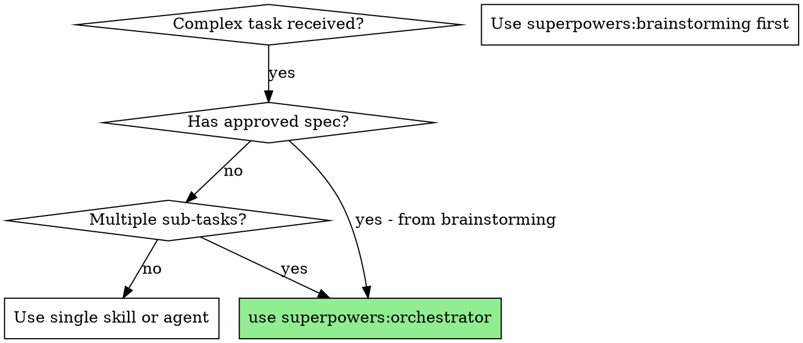

# Orchestrator

## Overview

Intelligent task orchestrator that analyzes complex requests, maps them to specialized skills, selects the optimal execution mode (Agent / Workflow / Team), and coordinates execution with dependency management and context passing.

**Core principle:** Clarify first, route skills, then execute with the right tool for the job.

**Announce at start:** "I'm using the orchestrator skill to coordinate this task."

## When to Use

**Two entry paths:**
- **From brainstorming** — Spec already written and approved. Read spec, skip clarification, go directly to skill routing.
- **Direct invocation** — No spec exists. User describes a coordination task (parallel bugs, multi-step refactor, etc.). Do quick clarification first.

**Use when:**
- Task spans multiple domains (UI + backend, design + implementation)
- Multiple sub-tasks with dependencies between them
- Need to run tasks in parallel with context flow
- Task complexity is beyond simple sequential agent dispatch
- Brainstorming completed and spec is ready for execution

**Don't use when:**
- Simple single-domain task → use the relevant skill directly
- Need to design something new → use `superpowers:brainstorming` first
- Already have a written implementation plan → use `superpowers:subagent-driven-development`

## The Four Phases

Phases execute in order: **Clarify → Route Skills → Decide Mode → Execute**

### Phase 1: Understand the Task

**Two modes based on entry path:**

**Mode A — Spec Available (from brainstorming):**
1. Read the spec document
2. Extract sub-tasks, dependencies, and technical domains from the spec
3. Skip clarification — spec already captures user intent
4. Proceed directly to Phase 2

**Mode B — No Spec (direct invocation):**
1. **Explore context** — Check current project state (files, recent changes, relevant code)
2. **Ask one question at a time** — Understand: overall goal, sub-tasks, dependencies, domains, constraints
3. **Confirm understanding** — Restate the task in your own words, ask for approval

**Scope check:** If the task requires open-ended design exploration (not just coordination), stop and recommend `superpowers:brainstorming` first. Orchestrator coordinates known work — it does not design from scratch.

**Decision: Is this too large for one plan?** If the spec or task description covers multiple independent subsystems, flag this. Suggest decomposing into separate spec → orchestrator cycles, one per subsystem.

**Output of Phase 1:** A structured list of sub-tasks with dependencies noted.

### Phase 2: Route Skills

Invoke `superpowers:skill-router` (via Skill tool) to identify which skills should be loaded for each sub-task.

**Process:**

1. Invoke Skill tool with `skill="superpowers:skill-router"`, passing the sub-task list
2. Review the matched skills and their injection instructions
3. Note which skills apply to which sub-tasks

**If no skills match:** That's fine — some tasks don't need specialized skills. Proceed without injection.

### Phase 3: Decide Execution Mode

Read the routing logic in `routing-logic.md` (in this skill's directory) and select the execution mode.

**Quick decision:**

| Signal | Mode |
|--------|------|
| 1-2 tasks, no dependencies | **Agent** |
| 3+ tasks with stage flow | **Workflow** |
| 3+ specialized roles, real-time comms | **Team** |
| Pipeline + multi-role stages | **Hybrid** |

### Phase 4: Execute

Execute using the selected mode. Read `workflow-patterns.md` in this skill's directory for construction patterns and code templates.

**Agent Mode:** Dispatch single Agent with skill injection in prompt. Review result.

**Workflow Mode:** Build a Workflow script with `pipeline()` for sequential stages and `parallel()` for independent tasks. Each `agent()` call gets skill injection.

**Team Mode:** Create team, create tasks with `addBlockedBy` dependencies, spawn teammates with skill injection in their prompts, monitor via `TaskList`, shutdown when done.

**Skill injection pattern (all modes):** Append to every agent prompt: `Before starting, invoke the Skill tool with skill="{matched-skill-name}" to load domain-specific guidance.`

## Context Passing Between Tasks

**Pipeline:** `pipeline()` passes `(prevResult, originalItem, index)` — upstream output flows downstream.
**Team:** `SendMessage` passes context between roles. Downstream reads from messages and `TaskGet`.
**Agent:** No context passing — single task.

## Handling Problems During Execution

- **Agent BLOCKED:** Re-dispatch with more context or break task down
- **Unexpected results:** Pipeline continues with what's available
- **Team task stalled:** Check `TaskList`, message the owner, re-assign if needed
- **No skills matched:** Proceed without injection — not every task needs specialized skills

## Red Flags

| Thought | Reality |
|---------|---------|
| "I can just dispatch agents sequentially" | Sequential dispatch loses context between tasks. Use the orchestrator. |
| "This is too complex to orchestrate" | That's exactly when orchestration is most valuable. Break it down further in Phase 1. |
| "I'll skip the clarification phase" | Unclear requirements → wrong orchestration → wasted work. Always clarify first. |
| "I don't need skill routing" | Skill injection ensures domain expertise is loaded. Never skip Phase 2. |
| "One mode fits all" | Wrong mode = wrong coordination. Use the routing logic. |

## Integration

**Required workflow skills:**
- **superpowers:brainstorming** — Design phase (precedes orchestrator for new features). Terminal state of brainstorming is invoking orchestrator.
- **superpowers:skill-router** — Phase 2 skill discovery
- **superpowers:writing-plans** — Creates detailed implementation plan (invoked by orchestrator when spec needs task breakdown)
- **superpowers:dispatching-parallel-agents** — Simplified parallel dispatch (alternative to full Workflow for simple cases)
- **superpowers:subagent-driven-development** — Sequential plan execution (alternative for pre-written plans)

**Supporting references (in this skill's directory):**
- `routing-logic.md` — Decision tree for mode selection
- `workflow-patterns.md` — Construction patterns for Workflow scripts and Team setup
