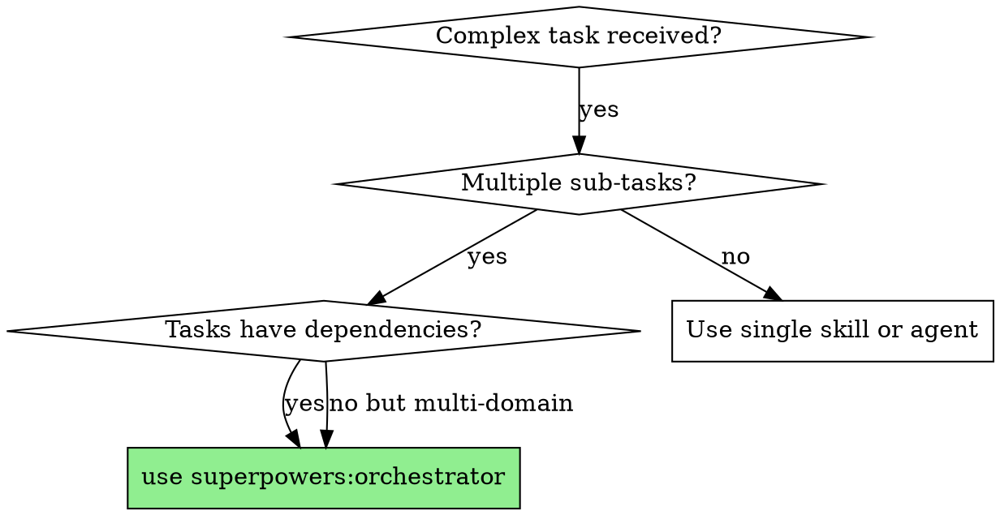
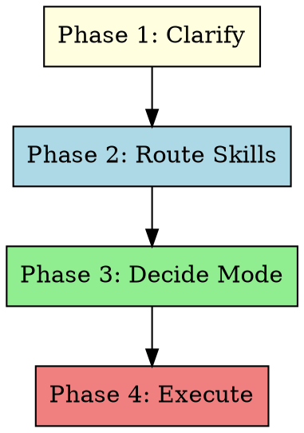

# Orchestrator

## Overview

Intelligent task orchestrator that analyzes complex requests, maps them to specialized skills, selects the optimal execution mode (Agent / Workflow / Team), and coordinates execution with dependency management and context passing.

**Core principle:** Clarify first, route skills, then execute with the right tool for the job.

**Announce at start:** "I'm using the orchestrator skill to coordinate this task."

## When to Use



**Use when:**
- Task spans multiple domains (UI + backend, design + implementation)
- Multiple sub-tasks with dependencies between them
- Need to run tasks in parallel with context flow
- Task complexity is beyond simple sequential agent dispatch

**Don't use when:**
- Simple single-domain task → use the relevant skill directly
- Building something from scratch → use `superpowers:brainstorming` first
- Already have a written plan → use `superpowers:subagent-driven-development`

## The Four Phases



### Phase 1: Clarify Requirements

Engage in multi-turn dialogue to understand the task. Do NOT skip this phase.

**Process:**

1. **Explore context** — Check current project state (files, recent changes, relevant code)
2. **Ask one question at a time** — Understand:
   - What is the overall goal?
   - What sub-tasks are involved?
   - What are the dependencies between sub-tasks?
   - What technical domains are involved?
   - What are the constraints or non-goals?
3. **Confirm understanding** — Restate the task in your own words, ask for approval

**Questions to ask (pick relevant ones, one at a time):**

- "What's the end result you want?"
- "Can you break this down into steps? Which steps depend on others?"
- "What technologies or domains does this touch?"
- "Are there any constraints I should know about?"
- "What would make this complete for you?"

**Exception:** If the request is to design something entirely new from scratch, recommend using `superpowers:brainstorming` → `superpowers:writing-plans` instead. Orchestrator is for coordinating known tasks, not open-ended design exploration.

**Output of Phase 1:** A structured list of sub-tasks with dependencies noted.

### Phase 2: Route Skills

Invoke `superpowers:skill-router` (via Skill tool) to identify which skills should be loaded for each sub-task.

**Process:**

1. Invoke Skill tool with `skill="superpowers:skill-router"`, passing the sub-task list
2. Review the matched skills and their injection instructions
3. Note which skills apply to which sub-tasks

**If no skills match:** That's fine — some tasks don't need specialized skills. Proceed without injection.

### Phase 3: Decide Execution Mode

Read the routing logic in `@routing-logic.md` (this directory) and select the execution mode.

**Quick decision:**

| Signal | Mode |
|--------|------|
| 1-2 tasks, no dependencies | **Agent** |
| 3+ tasks with stage flow | **Workflow** |
| 3+ specialized roles, real-time comms | **Team** |
| Pipeline + multi-role stages | **Hybrid** |

### Phase 4: Execute

Execute using the selected mode. Reference `@workflow-patterns.md` for construction patterns.

#### Agent Mode

1. Build prompt with skill injection instructions from Phase 2
2. Dispatch single Agent
3. Review result

```
Agent({
  description: "Task description",
  prompt: "{task details}\n\nIMPORTANT: Before starting, invoke the Skill tool with skill=\"{matched-skill}\" to load domain-specific guidance.",
  subagent_type: "general-purpose"
})
```

#### Workflow Mode

1. Construct a Workflow script following patterns from `@workflow-patterns.md`
2. Define `meta.phases` matching the task stages
3. Use `pipeline()` for sequential context flow
4. Use `parallel()` for independent same-level tasks
5. Inject skill loading instructions into each `agent()` prompt

**Skill injection in Workflow agent calls:**

```
agent('{task prompt}\n\nIMPORTANT: Before starting, invoke the Skill tool with skill="{skill-name}" to load domain-specific guidance.', {label: 'task-label', schema: RESULT_SCHEMA})
```

#### Team Mode

1. `TeamCreate({ team_name: '...', description: '...' })`
2. `TaskCreate` for each sub-task with `addBlockedBy` for dependencies
3. Spawn teammates via `Agent` with `team_name` and descriptive `name`
4. Each teammate's prompt includes skill injection instructions
5. Monitor via `TaskList`
6. When complete, shutdown teammates and `TeamDelete()`

**Skill injection in Team agent prompts:**

```
Agent({
  name: "role-name",
  team_name: "team-name",
  prompt: "You are the {role}. Your responsibilities: ...\n\nIMPORTANT: Before starting your tasks, invoke the Skill tool with skill=\"{matched-skill}\" to load domain-specific guidance. Check TaskList for available work."
})
```

## Context Passing Between Tasks

**Pipeline mode:** Use `pipeline()` — each stage receives `(prevResult, originalItem, index)` from the previous stage. Include previous results in the next agent's prompt.

**Team mode:** When a task completes, the teammate sends a message via `SendMessage`. The downstream teammate reads context from messages and `TaskGet` descriptions.

**Agent mode:** No context passing needed — single task.

## Handling Problems During Execution

**Agent fails or returns BLOCKED:**
- Assess the blocker. If it's a context issue, re-dispatch with more information. If it's a scope issue, break the task down further.

**Workflow agent returns unexpected results:**
- The pipeline continues. Include the raw result and ask the next agent to work with what's available.

**Team task stalled:**
- Check `TaskList`. If a task is blocking others, send a message to the owner. If they're stuck, re-assign or break the task down.

**No skills matched for a task:**
- Proceed without skill injection. Not every task needs a specialized skill.

## Red Flags

| Thought | Reality |
|---------|---------|
| "I can just dispatch agents sequentially" | Sequential dispatch loses context between tasks. Use the orchestrator. |
| "This is too complex to orchestrate" | That's exactly when orchestration is most valuable. Break it down further in Phase 1. |
| "I'll skip the clarification phase" | Unclear requirements → wrong orchestration → wasted work. Always clarify first. |
| "I don't need skill routing" | Skill injection ensures domain expertise is loaded. Never skip Phase 2. |
| "One mode fits all" | Wrong mode = wrong coordination. Use the routing logic. |

## Integration

**Required workflow skills:**
- **superpowers:skill-router** — Phase 2 skill discovery
- **superpowers:dispatching-parallel-agents** — Simplified parallel dispatch (alternative to full Workflow for simple cases)
- **superpowers:subagent-driven-development** — Sequential plan execution (alternative for pre-written plans)

**Supporting references:**
- **@routing-logic.md** — Decision tree for mode selection
- **@workflow-patterns.md** — Construction patterns for Workflow scripts and Team setup
