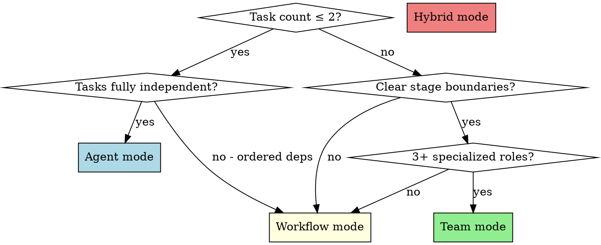

# Routing Logic Reference

Decision tree for selecting execution mode. Read this after completing the clarification phase (Phase 1).

## Decision Tree

## Mode Selection Criteria

### Agent Mode

**When:** 1-2 independent tasks, no dependencies between them, no specialized roles needed.

**How:**
1. Invoke `superpowers:skill-router` to identify matching skills
2. Build agent prompt with skill injection instructions
3. Dispatch single Agent with the enriched prompt
4. Review result when agent returns

**Example scenario:** "Fix a CSS bug in the header and update the button color"

### Workflow Mode

**When:** 3+ tasks with clear stage boundaries, data flows between stages, or mix of parallel + sequential work.

**How:**
1. Invoke `superpowers:skill-router` for each stage
2. Define phases matching the stages
3. Use `pipeline()` for sequential stages with context flow
4. Use `parallel()` within a stage for independent sub-tasks
5. Each `agent()` call gets skill injection in its prompt

**Key mechanism:** `pipeline()` passes `(prevResult, originalItem, index)` to each stage — upstream output naturally flows downstream.

**Example scenario:** "Design a dashboard UI → Implement components → Write integration tests"

### Team Mode

**When:** 3+ specialized roles that need real-time coordination, complex dependency graph, or tasks need ongoing communication.

**How:**
1. Invoke `superpowers:skill-router` for each role's tasks
2. `TeamCreate` with descriptive name
3. `TaskCreate` for each task, use `addBlockedBy` for dependencies
4. Spawn teammates via `Agent` tool with `team_name` and `name`
5. Assign tasks via `TaskUpdate` with `owner`
6. Teammates communicate via `SendMessage` for context passing
7. Monitor via `TaskList`

**Key mechanism:** `TaskCreate(addBlockedBy)` enforces execution order. `SendMessage` passes context between roles.

**Example scenario:** "Designer creates mockups → Frontend implements → Backend builds API → QA tests integration"

### Hybrid Mode

**When:** Outer orchestration is a pipeline (Workflow), but specific stages need multi-role collaboration (Team).

**How:**
1. Use Workflow for the top-level pipeline
2. For stages needing collaboration, dispatch an agent that internally creates a Team
3. The Team agent acts as mini-lead for that stage

**Example scenario:** "Design system (Team: designer + architect) → Implement (Workflow: parallel components) → Review (Agent: single reviewer)"

## Dependency Graph Construction

For any mode with dependencies:

1. **List all sub-tasks** identified during Phase 1
2. **Identify dependencies** — which tasks need output from other tasks?
3. **Build a DAG:**
   - Tasks with no dependencies → Level 0 (can start immediately)
   - Tasks depending on Level 0 → Level 1
   - Tasks depending on Level 1 → Level 2
   - etc.
4. **Same-level tasks** can run in parallel
5. **Cross-level tasks** must be sequential

This DAG directly maps to:
- Workflow: `parallel()` for same-level, `pipeline()` stages for levels
- Team: `TaskCreate(addBlockedBy)` based on DAG edges
