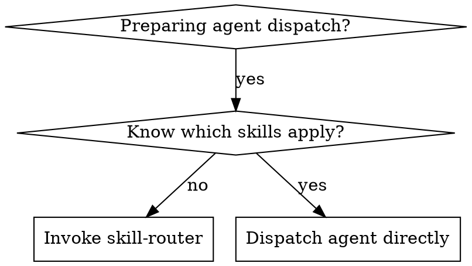

# Skill Router

## Overview

Semantic scanner that discovers which installed skills are relevant to a given task. Reads skill frontmatter, matches task keywords against skill descriptions, and generates injection instructions for agent prompts.

**Core principle:** Zero-config skill discovery — any newly installed skill is automatically discoverable without registration.

## When to Use



**Use when:**
- Preparing to dispatch an agent for a task and unsure which skills are relevant
- Orchestrator needs to map sub-tasks to specialized skills
- Want to ensure domain-specific skills (UI, debugging, testing) are loaded for appropriate tasks

**Don't use when:**
- You already know exactly which skill applies
- The task is trivial and no skill is needed

## The Scanning Process

### Step 1: Collect Skill Registry

Read the frontmatter of all registered skills. Sources to scan:

1. **Plugin skills:** All files matching `skills/*/SKILL.md` in installed plugins
2. **User skills:** All files matching `~/.claude/skills/*/SKILL.md`

For each skill, extract:
- `name` — the skill identifier (e.g., `ui-ux-pro-max`)
- `description` — the full description text (rich in keywords and triggers)

Output: A list of `{name, description}` pairs.

**How to collect:** Use the Glob tool to find all `SKILL.md` files, then Read each file's YAML frontmatter (the content between the `---` markers at the top).

### Step 2: Extract Task Keywords

From the task description, identify three categories of keywords:

- **Domain keywords:** UI, backend, debugging, testing, design, game engine, database, etc.
- **Action keywords:** create, fix, refactor, compile, deploy, review, style, layout, etc.
- **Technology keywords:** React, Lua, Godot, Cocos, Python, TypeScript, Prefab, etc.

**Extraction method:** Read the task description and list all nouns, verbs, and technology names that could relate to a specific domain or tool.

### Step 3: Semantic Matching

Compare task keywords against each skill's `description` field. Score each match:

- **High match:** Multiple keywords overlap, description explicitly mentions the domain
- **Medium match:** Some keyword overlap, tangentially related
- **Low match:** Minimal overlap, unlikely to be relevant

**Return only High and Medium matches.** Discard Low matches.

### Step 4: Generate Injection Instructions

For each matched skill, generate an injection block:

```
BEFORE starting this task, you MUST invoke the Skill tool with skill="{matched-skill-name}" to load domain-specific guidance. Follow the loaded skill's instructions during implementation.
```

The orchestrator appends these injection blocks to each agent's prompt before dispatch.

## Output Format (MANDATORY)

<HARD-GATE>
Your output MUST follow this exact structured format. The orchestrator's Phase 4 consumes this output programmatically. Do NOT summarize in prose, tables, or narrative. Do NOT omit the INJECT lines. Each task MUST have its injection strings ready to copy-paste into agent prompts.
</HARD-GATE>

```
=== SKILL ROUTING RESULTS ===

TASK: {task-id-or-description}
STATUS: {MATCHED | NO_MATCH}
  1. {skill-name} — {match reason: which keywords overlapped}
     INJECT: "IMPORTANT: Before starting, invoke the Skill tool with skill=\"{skill-name}\" to load domain-specific guidance."
  2. {skill-name} — {match reason}
     INJECT: "IMPORTANT: Before starting, invoke the Skill tool with skill=\"{skill-name}\" to load domain-specific guidance."

TASK: {next-task-id-or-description}
STATUS: NO_MATCH
(no specialized skills needed for this task)

=== END ROUTING RESULTS ===
```

Every TASK block MUST include STATUS and either INJECT lines or a NO_MATCH explanation.

## Common Mistakes

| Mistake | Fix |
|---------|-----|
| Only checking skill names | Descriptions contain richer trigger info — always read them |
| Matching too broadly | Filter to High/Medium only. Low matches waste context |
| Forgetting user skills | Scan `~/.claude/skills/` in addition to plugin skills |
| Hardcoding skill mappings | The whole point is dynamic discovery. Never hardcode |

## Real-World Matching Examples

**Task: "Design a settings page with toggle switches and dropdown menus"**
→ Matches: `ui-ux-pro-max:ui-ux-pro-max`, `ui-ux-pro-max:ui-styling`
→ Reason: "design", "page", "toggle", "dropdown" all relate to UI/UX

**Task: "Fix the camera jitter when following the player"**
→ Matches: `closeup-camera-system`
→ Reason: "camera", "following" match camera system domain

**Task: "Debug why the Lua binding isn't updating the prefab"**
→ Matches: `jx3-prefab-mcp-luaui`, `superpowers:systematic-debugging`
→ Reason: "Lua binding", "prefab" match Cocos/Lua domain; "debug" matches debugging skill

**Task: "Add a login endpoint to the API"**
→ Matches: none (generic backend task, no specialized skill needed)
→ Note: No injection needed, proceed with standard implementation
